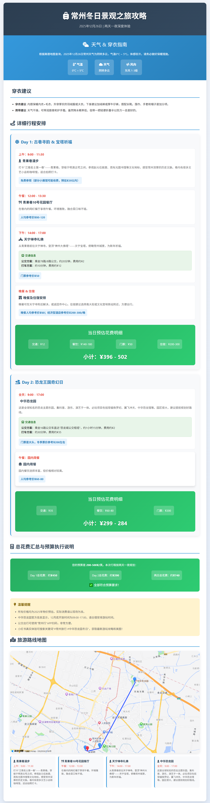

# TripMind 旅行规划助手
一个基于 Spring Boot 和 Spring AI 开发的智能旅行规划助手，集成高德地图 API 提供地理信息服务。

## 功能特性

### 核心功能
- **智能旅行规划**：根据用户需求生成个性化旅行方案
- **地理信息服务**：集成高德地图 API 提供丰富的地理数据
- **工具扩展机制**：支持多种工具的集成和扩展
- **Token 计数统计**：精确统计 AI 模型调用的输入/输出 token 数量
- **HTML 旅行计划生成**：将旅行规划转换为精美的 HTML 页面并自动保存


### 集成工具
- **文件操作工具**：提供文件读写操作能力，支持自动保存 HTML 旅行计划
- **PDF 生成工具**：支持生成旅行规划 PDF 文档
- **网页抓取工具**：获取互联网上的旅行相关信息
- **终端操作工具**：执行系统命令
- **HTML 生成工具**：将旅行规划转换为可视化的 HTML 页面
- **高德地图 API 工具**：
  - 地理编码：将地址转换为经纬度坐标
  - 逆地理编码：将经纬度转换为地址信息
  - 驾车路径规划：获取最优驾车路线
  - 步行路径规划：获取步行路线
  - 兴趣点搜索：搜索美食、景点等旅行相关地点

## 技术栈

- **后端框架**：Spring Boot 3.4.12
- **编程语言**：Java 21
- **AI 框架**：Spring AI 1.0.0-M6
- **大模型**：阿里巴巴达摩院 DashScope
- **地理服务**：高德地图 API
- **工具库**：
  - Hutool：Java 工具集
  - iText：PDF 生成
  - Jsoup：HTML 解析
  - Lombok：简化 Java 代码
  - MyBatis：ORM 框架
- **API 文档**：Knife4j (OpenAPI 3)
- **数据库**：MySQL

## 快速开始

### 环境要求
- JDK 21+
- Maven 3.6+
- MySQL 8.0+

### 安装步骤

1. **克隆仓库**
   ```bash
   git clone https://github.com/your-username/ai-agent.git
   cd ai-agent
   ```

2. **编译构建**
   ```bash
   mvn clean install
   ```

3. **数据库配置**
   - 创建数据库：`ai_agent_db`
   - 导入数据库表结构（如有需要）

4. **配置 API 密钥**
   编辑 `src/main/resources/application.yml` 文件，配置必要的 API 密钥：
   ```yaml
   spring:
     ai:
       dashscope:
         api-key: ${ai.api-key}  # 阿里巴巴达摩院 API 密钥
   
   # 高德地图 API 配置
   amap:
     api-key: ${amap.api-key}  # 高德地图 API 密钥
   ```

5. **启动应用**
   ```bash
   mvn spring-boot:run
   ```

6. **访问应用**
   - API 文档：http://localhost:8123/api/swagger-ui.html
   - 应用接口：http://localhost:8123/api

## 使用示例

### 1. 智能旅行规划

```java
TripMindMCP tripMindMCP = new TripMindMCP(dashscopeChatModel, resourceLoader);
String travelPlan = tripMindMCP.generateTravelPlanWithMCP(
    "chat123",          // 对话ID
    "北京",             // 目的地
    "2026-01-01至2026-01-05", // 出行时间
    "历史文化,美食",    // 兴趣偏好
    "5000-8000元"       // 预算
);
```

### 2. 生成HTML旅行计划

```java
String travelPlan = "# 北京三日游\n## 第一天\n- 上午：参观故宫博物院...";
String htmlContent = tripMindMCP.generateTravelHtml(travelPlan, "北京");
```

### 3. 一体化旅行计划生成（带HTML）

```java
Map<String, String> result = tripMindMCP.generateTravelPlanWithHtml(
    "chat123",          // 对话ID
    "北京",             // 目的地
    "2026-01-01至2026-01-05", // 出行时间
    "历史文化,美食",    // 兴趣偏好
    "5000-8000元"       // 预算
);
String travelPlan = result.get("travelPlan");
String htmlContent = result.get("htmlContent");
```
## 效果如图



## 项目结构

```
src/
├── main/
│   ├── java/com/zhishi/aiagent/
│   │   ├── advisor/           # 聊天客户端增强器
│   │   ├── app/               # 应用服务类
│   │   │   ├── TripMindMCP.java      # 旅行规划主服务（带Token计数和HTML生成）
│   │   │   ├── TripMindTools.java    # 带工具调用的旅行规划服务
│   │   │   └── ...
│   │   ├── controller/        # 控制器层
│   │   ├── dto/               # 数据传输对象
│   │   ├── mapper/            # MyBatis 映射器
│   │   ├── service/           # 业务逻辑层
│   │   ├── tools/             # 工具类
│   │   │   ├── AmapAPITool.java      # 高德地图 API 工具
│   │   │   ├── FileOperationTool.java # 文件操作工具
│   │   │   ├── PDFGenerationTool.java # PDF 生成工具
│   │   │   ├── ToolRegistration.java  # 工具注册配置
│   │   │   └── ...
│   │   └── Application.java   # 应用主类
│   └── resources/
│       ├── mapper/            # MyBatis 映射文件
│       ├── templates/         # 提示词模板
│       │   ├── TripMindSimplePrompt.st  # 旅行规划提示词
│       │   ├── TravelHtmlPrompt.st     # HTML生成提示词
│       │   └── ...
│       ├── application.yml    # 应用配置
│       └── mcp-servers.json   # MCP 服务器配置
└── test/                      # 测试代码
```

## API 文档

项目使用 Knife4j 生成 OpenAPI 3 标准的 API 文档，可通过以下地址访问：

http://localhost:8123/api/swagger-ui.html

## 贡献指南

1. Fork 本仓库
2. 创建特性分支 (`git checkout -b feature/AmazingFeature`)
3. 提交更改 (`git commit -m 'Add some AmazingFeature'`)
4. 推送到分支 (`git push origin feature/AmazingFeature`)
5. 打开 Pull Request

## 许可证

本项目采用 Apache License 2.0 许可证 - 查看 [LICENSE](LICENSE) 文件了解详情。

## 联系方式

- 项目地址：https://github.com/your-username/ai-agent
- 问题反馈：https://github.com/your-username/ai-agent/issues

## 更新日志

### v0.0.2-SNAPSHOT (2025-12-25)
- 新增 TripMindMCP 服务类，实现智能旅行规划核心功能
- 集成 Token 计数统计功能，精确跟踪模型调用的 token 使用量
- 新增 HTML 旅行计划生成功能，支持将旅行规划转换为精美的 HTML 页面
- 优化工具调用机制，统一使用 ToolCallback[] allTools 注入模式
- 实现自动文件保存功能，支持将生成的 HTML 旅行计划保存到本地

### v0.0.1-SNAPSHOT (2025-12-24)
- 初始版本发布
- 集成基础工具集
- 新增高德地图 API 工具，支持地理编码、路径规划、兴趣点搜索等功能
